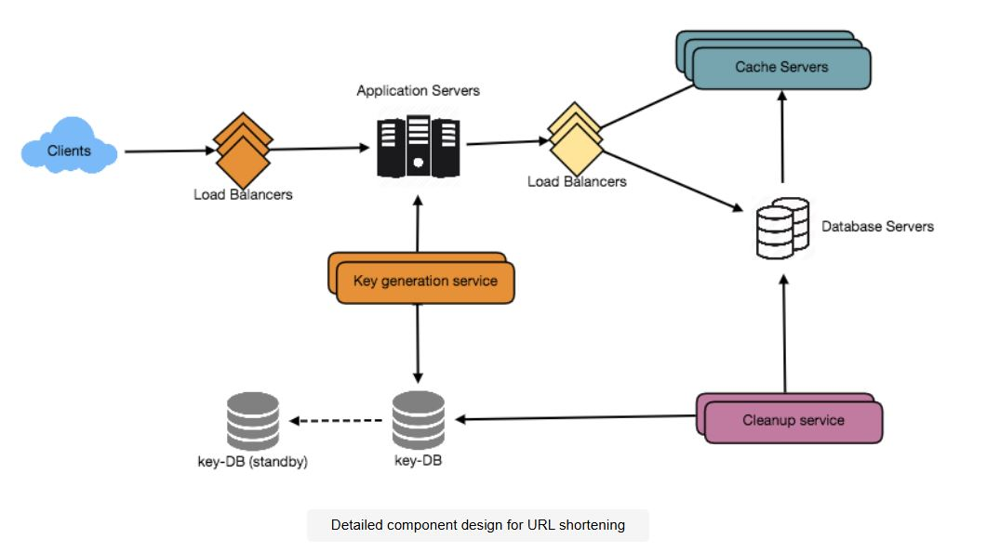
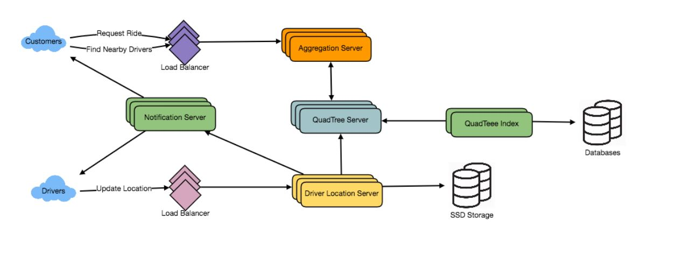

# System design Problems List

## Table of Contents
- [1. URL Shortener System Design](#1-url-shortener-system-design)
- [2. Uber System Design](#2-uber-system-design)
- [3. YouTube System Design](#3-youtube-system-design)
- [4. Nearby Friends System Design](#4-nearby-friends-system-design)
- [5. Web Crawler System Design](#5-web-crawler-system-design)
- [6. Instagram System Design](#6-instagram-system-design)
- [7. Twitter Search System Design](#7-twitter-search-system-design)
- [8. API Rate Limiter System Design](#8-api-rate-limiter-system-design)
- [9. Twitter System Design](#9-twitter-system-design)
- [10. Facebook Messenger System Design](#10-facebook-messenger-system-design)

# 1. URL Shortener System Design

## S - Scope & Requirements (2-3 min)

### Functional Requirements
- Generate short unique URLs from long URLs
- Redirect users to original URL when accessing short URL
- Allow custom URL aliases (optional)
- Set expiration on URLs
- Delete/update existing URLs

### Non-Functional Requirements
- Highly available system (URL redirection should always work)
- Low latency for redirections
- URLs should not be predictable
- System should be scalable

### Clarifying Questions
- What's the expected URL length?
- Should we allow custom URLs?
- Do URLs expire automatically?
- Do we need analytics?

### Constraints & Assumptions
- Maximum URL length: 2048 characters
- Custom URLs limited to 16 characters
- Default expiration: 2 years
- URLs are case sensitive

## C - Capacity Estimation (3-4 min)

### Traffic Estimates
- 500M new URLs per month
- Read:Write ratio = 100:1
- QPS calculations:
  - Writes: 200 URLs/second
  - Reads: 20K redirects/second

### Storage Estimates
- Storage per URL: ~500 bytes
- 5-year storage: 15TB
- New storage per day: ~8GB

### Memory Estimates
- 20% hot URLs cached
- Cache size: 170GB
- Cache entries: ~340M URLs

## A - API Design (2-3 min)

### Key Endpoints
```
POST /api/v1/shorten
  Request: {
    "longUrl": "string",
    "customAlias": "string" (optional),
    "expireDate": "date" (optional)
  }
  Response: {
    "shortUrl": "string",
    "expirationDate": "date"
  }

GET /api/v1/{shortUrl}
  Response: HTTP 302 redirect to long URL
```

## L - Low-Level Design (8-10 min)

### Database Schema
```sql
URLs Table:
  - hash (PK): varchar(16)
  - original_url: varchar(2048)
  - creation_date: timestamp
  - expiration_date: timestamp
  - user_id: integer

Users Table:
  - user_id (PK): integer
  - email: varchar(255)
  - api_key: varchar(64)
```

### Core Algorithms
- URL Encoding: Base62 encoding
- Key Generation Service (KGS)
- Cache eviction: LRU policy

## E - Entire Architecture (8-10 min)

### System Components
1. Load Balancers (NGINX)
   - Client traffic distribution
   - Database traffic distribution

2. Application Servers
   - URL shortening logic
   - Redirection handling

3. Cache Layer (Redis)
   - Hot URL storage
   - LRU eviction

4. Database Layer
   - Primary: URL mappings
   - Secondary: Analytics

5. Key Generation Service
   - Pre-generates unique keys
   - Maintains used/unused keys

### Data Flow
1. Client sends long URL
2. Load balancer routes request
3. App server generates/fetches short key
4. Database stores mapping
5. Cache updated
6. Short URL returned to client

## D - Deep Dive & Discussion (5-8 min)

### Scalability Approaches
- Database sharding by URL hash
- Cache replication
- Consistent hashing for load balancing

### Failure Handling
- Database replication for redundancy
- Multiple data center deployment
- Cache fallback strategies

### Monitoring & Security
- Rate limiting by API key
- Analytics tracking
- Request logging
- Security measures (SQL injection, XSS)

 

-----------------------------------------------------------------------------------------------------


# 2. Uber System Design

## 🟢 S - Scope & Requirements (2-3 min)

### Functional Requirements
- Real-time driver location tracking
- Nearby driver discovery
- Ride requesting and matching
- Live trip tracking
- Trip completion and payment
- Driver availability management

### Non-Functional Requirements
- Low latency (real-time updates < 3 seconds)
- High availability (24/7 service)
- Consistent driver-rider matching
- Location accuracy
- Scalable to millions of concurrent users

### Constraints & Assumptions
- Drivers update location every 3 seconds
- Active drivers are always connected
- Mobile app is primary interface
- GPS accuracy is reliable
- Network connectivity is mostly stable

## 🟢 C - Capacity Estimation (3-4 min)

### Users & Traffic
- Total Users: 300M customers, 1M drivers
- Daily Active: 1M customers, 500K drivers
- Daily Rides: 1M
- Location Updates: 500K drivers × updates every 3s = ~167K RPS

### Storage & Bandwidth
- Driver Location Update Size: 19 bytes
- Location Update Bandwidth: 47.5 MB/s
- Subscription Storage: 21MB for active users
- Total Storage: 35MB for DriverLocationHT

## 🟢 A - API Design (2-3 min)

### Key Endpoints
```
POST /driver/location
    Request: {driverId, latitude, longitude, availability}
    Response: {success, timestamp}

GET /drivers/nearby
    Request: {latitude, longitude, radius}
    Response: [{driverId, location, rating, ...}]

POST /ride/request
    Request: {userId, pickup, destination}
    Response: {rideId, driverId, eta}

GET /ride/{rideId}/status
    Response: {status, driverLocation, eta}
```

## 🟢 L - Low-Level Design (8-10 min)

### Data Structures
- QuadTree: For spatial indexing of driver locations
- DriverLocationHT: Hash table for real-time location updates
- Subscription Manager: For managing customer-driver live updates

### Database Schema
```sql
Drivers
- driver_id
- current_location
- availability_status
- rating

Rides
- ride_id
- customer_id
- driver_id
- pickup_location
- destination
- status
- timestamp
```

## 🟢 E - Entire Architecture (8-10 min)

### Components
- Mobile Apps (iOS/Android)
- Location Service
- Match Making Service
- Trip Management Service
- Notification Service
- Payment Service

### Infrastructure
- Load Balancers: For distributing traffic
- WebSocket Servers: For real-time communication
- QuadTree Servers: For location indexing
- Notification Servers: For push notifications
- Cache Layer: Redis for frequent location queries
- Message Queue: Kafka for async processing
- Primary DB: PostgreSQL for trip data
- Geo-Database: MongoDB for location data

## 🟢 D - Deep Dive & Discussion (5-8 min)

### Scalability
- Distribute DriverLocationHT across multiple servers
- Partition QuadTree by geographic regions
- Cache frequently accessed driver locations
- Use read replicas for scaling queries

### Fault Tolerance
- Replicated servers for critical services
- Persistent storage backup
- Graceful degradation strategy
- Circuit breakers for failing components

### Monitoring & Performance
- Driver location update latency
- Matching algorithm performance
- System error rates
- Customer matching success rate

### Security
- Authentication for all API endpoints
- Rate limiting for location updates
- Encryption for sensitive data
- Fraud detection system

### Edge Cases
- Network disconnections during rides
- Surge pricing implementation
- Multiple ride requests for same driver
- Driver availability status accuracy
- Payment failure handling



-----------------------------------------------------------------------------------------------------

# 3. YouTube System Design

## 🟢 S - Scope & Requirements (2-3 min)

### Functional Requirements
- Upload videos
- View/stream videos
- Search videos by title
- Like/dislike videos
- Comment on videos
- Track video statistics

### Non-Functional Requirements
- High reliability (no video loss)
- High availability (prefer over consistency)
- Low latency streaming
- Real-time video playback without lag
- Scalable to handle massive concurrent views

### Clarifying Questions
- What video formats are supported?
- Maximum video size limit?
- Video quality requirements?
- Geographic distribution of users?
- Authentication requirements?

### Constraints & Assumptions
- Users can upload videos of any length
- Videos need to be stored in multiple formats
- Global user base requiring CDN
- Read-heavy system (200:1 read:write ratio)

## 🟢 C - Capacity Estimation (3-4 min)

### Users & Traffic
- 1.5B total users
- 800M daily active users (DAU)
- 46K video views/second
- 230 video uploads/second

### Storage & Bandwidth
- Storage:
  - 500 hours of video uploaded/minute
  - 50MB per minute of video
  - 1500 GB/minute (25 GB/second)
  
- Bandwidth:
  - Upload: 5 GB/second
  - Download: 1 TB/second (1:200 ratio)

## 🟢 A - API Design (2-3 min)

### Key Endpoints
```
POST /api/videos
- Upload new video with metadata
- Parameters: api_dev_key, title, description, tags[], category_id, language, video_contents

GET /api/videos/search
- Search videos
- Parameters: api_dev_key, search_query, user_location, max_results, page_token

GET /api/videos/stream/{video_id}
- Stream video content
- Parameters: api_dev_key, video_id, offset, codec, resolution
```

## 🟢 L - Low-Level Design (8-10 min)

### Database Schema

#### Videos Table
```sql
CREATE TABLE videos (
    video_id VARCHAR(255) PRIMARY KEY,
    title VARCHAR(255),
    description TEXT,
    size INT,
    uploader_id INT,
    thumbnail_path VARCHAR(255),
    views INT,
    likes INT,
    dislikes INT,
    created_at TIMESTAMP
);
```

#### Comments Table
```sql
CREATE TABLE comments (
    comment_id VARCHAR(255) PRIMARY KEY,
    video_id VARCHAR(255),
    user_id INT,
    comment_text TEXT,
    created_at TIMESTAMP
);
```

### Core Algorithms
- Video encoding algorithm
- Deduplication detection
- Thumbnail generation
- Search ranking algorithm
- Cache eviction (LRU)

## 🟢 E - Entire Architecture (8-10 min)

### Components
1. Client Applications
   - Web interface
   - Mobile apps
   - Smart TV apps

2. CDN Layer
   - Globally distributed
   - Caches popular videos
   - Reduces latency

3. Load Balancers
   - Distribute incoming traffic
   - Handle upload/view separately

4. Application Services
   - Upload service
   - Streaming service
   - Search service
   - Analytics service

5. Storage Systems
   - Video storage (HDFS/GlusterFS)
   - Metadata DB (MySQL)
   - Cache layer (Redis/Memcached)
   - Thumbnail storage (Bigtable)

6. Processing Queue
   - Video encoding
   - Thumbnail generation
   - Analytics processing

## 🟢 D - Deep Dive & Discussion (5-8 min)

### Scalability Approaches
- Horizontal scaling of services
- Database sharding (by VideoID)
- Read replicas for metadata
- Consistent hashing for cache distribution

### Failure Points & Solutions
- Video upload failures → Resumable uploads
- Storage node failures → Replication
- CDN node failures → Multiple CDN providers
- Database failures → Master-slave configuration

### Monitoring & Performance
- Video upload success rate
- Streaming latency
- Cache hit ratio
- CDN performance
- Error rates and types

### Security Considerations
- Video upload authentication
- Content validation
- Rate limiting
- Copyright detection
- DDoS protection

### Advanced Features
- Video deduplication
- Adaptive bitrate streaming
- Regional content delivery optimization
- Real-time analytics processing

-----------------------------------------------------------------------------------------------------

## 4. Nearby Friends System Design

## 🟢 S - Scope & Requirements (2-3 min)

### Functional Requirements
- Add/delete/update places
- Search nearby places within radius
- Add reviews (text, photos, ratings)
- Rate and review places
- Filter by categories (restaurants, shopping, etc.)

### Non-Functional Requirements
- Low latency for search (real-time experience)
- High availability for read operations
- Eventually consistent writes acceptable
- Results should be location-relevant

### Clarifying Questions
- What is the search radius limit?
- Do we need real-time updates for new places?
- Should we support multiple languages?
- Do we need to support mobile apps?

### Constraints & Assumptions
- User location accuracy is within acceptable GPS range
- Reviews can be delayed in showing up
- Search results prioritize accuracy over completeness

## 🟢 C - Capacity Estimation (3-4 min)

### Traffic Estimates
- 500M total places
- 100K QPS (Queries Per Second)
- Read to Write ratio: 100:1 (more searches than updates)
- 20% annual growth rate

### Storage Estimates
- Per place: ~793 bytes
  - LocationID: 8 bytes
  - Name: 256 bytes
  - Coordinates: 16 bytes
  - Description: 512 bytes
  - Category: 1 byte
- Total storage for places: 500M * 793 bytes ≈ 396.5 GB
- Reviews and photos will need additional storage

### Bandwidth Estimates
- Average response size: 1KB per place
- For 100 places per search: 100KB per request
- Bandwidth: 100K QPS * 100KB = 10GB/s

## 🟢 A - API Design (2-3 min)

### Search API
```
GET /api/v1/places/search
Parameters:
- api_dev_key: string
- latitude: float
- longitude: float
- radius: int (meters)
- category: string (optional)
- sort: enum (DISTANCE, RATING)
- page_token: string

Response:
{
  "places": [{
    "id": string,
    "name": string,
    "location": {lat, lng},
    "rating": float,
    "category": string
  }],
  "next_page_token": string
}
```

### Review API
```
POST /api/v1/places/{place_id}/reviews
{
  "rating": int,
  "text": string,
  "photos": [binary]
}
```

## 🟢 L - Low-Level Design (8-10 min)

### Database Schema
```sql
Places:
  - location_id (PK)
  - name
  - latitude
  - longitude
  - description
  - category
  - created_at
  - updated_at

Reviews:
  - review_id (PK)
  - location_id (FK)
  - user_id
  - rating
  - text
  - created_at
```

### Core Components
- QuadTree Implementation
  - Node capacity: 500 places
  - Dynamic splitting when full
  - Leaf node connection for neighbor search
- Geohashing Algorithm
  - Convert lat/long to grid identifier
  - Support for radius search

## 🟢 E - Entire Architecture (8-10 min)

### System Components
1. Load Balancers
   - Route requests based on location
   - Health checking

2. Application Servers
   - Handle API requests
   - Implement business logic
   - Cache coordination

3. QuadTree Servers
   - Store location indices
   - Handle proximity queries
   - Memory optimized

4. Cache Layer
   - Store hot places
   - LRU eviction
   - Memcached/Redis

5. Database Servers
   - Primary for writes
   - Replicas for reads
   - Sharded by LocationID

### Data Flow
1. Client sends location-based search
2. Load balancer routes to nearest datacenter
3. Application server processes request
4. QuadTree server finds relevant grids
5. Cache/DB fetches place details
6. Results aggregated and returned

## 🟢 D - Deep Dive & Discussion (5-8 min)

### Scalability
- Horizontal scaling of application servers
- Database sharding by LocationID
- Read replicas for scaling reads
- CDN for static content (images)

### Failure Handling
- QuadTree server redundancy
- Master-slave replication
- Automatic failover
- Data rebuilding strategy

### Monitoring & Performance
- Query latency tracking
- Cache hit/miss rates
- Server load monitoring
- Error rate tracking

### Optimizations
- Batch updates for popularity scores
- Precomputed grids for common radiuses
- Caching strategy for hot areas
- Background jobs for analytics

### Security
- Rate limiting by API key
- Input validation
- DDOS protection
- Data encryption

-----------------------------------------------------------------------------------------------------

## 5. Web Crawler System Design

## 🟢 S - Scope & Requirements (2-3 min)

### Functional Requirements
- Crawl web pages systematically
- Extract and store webpage content
- Follow links to discover new pages
- Respect robots.txt rules
- Handle different content types (HTML, images, etc.)

### Non-Functional Requirements
- Scalability: Handle billions of web pages
- Politeness: Don't overwhelm web servers
- Freshness: Regular recrawling of content
- Robustness: Handle malformed HTML, broken links
- Extensibility: Easy to add new content types

### Clarifying Questions
- What's the crawling scope? (Whole web vs specific sites)
- Content types to handle? (HTML only vs multimedia)
- How fresh should the data be?
- Priority for different websites?
- Storage duration for crawled content?

### Constraints & Assumptions
- Handle 1 billion pages per month
- HTML-focused initially, extensible later
- Store content for 3 months
- Respect robots.txt and crawl delays
- Handle international websites

## 🟢 C - Capacity Estimation (3-4 min)

### Traffic Estimation
```
Daily Active Crawls = 33M pages/day
RPS = 33M / (24 * 3600) ≈ 382 pages/second
Peak RPS = 382 * 3 ≈ 1,146 pages/second
```

### Storage Estimation
```
Average page size = 100KB
Daily storage = 33M * 100KB = 3.3TB/day
3-month storage = 3.3TB * 90 = 297TB
With replication (3x) = 891TB
```

### Bandwidth Estimation
```
Download bandwidth = 382 pages/sec * 100KB = 38.2 MB/second
Peak bandwidth = 114.6 MB/second
Monthly bandwidth = 100TB
```

## 🟢 A - API Design (2-3 min)

### RESTful APIs
```javascript
// Add new URLs to crawl
POST /api/crawl/submit
{
    "urls": ["http://example.com"],
    "priority": 1,
    "recrawl_frequency": "daily"
}

// Get crawl status
GET /api/crawl/status/{domain}

// Get crawled content
GET /api/content/{url_hash}

// Update crawl configuration
PUT /api/crawl/config
{
    "politeness_delay": 1000,
    "max_depth": 3,
    "allowed_domains": ["example.com"]
}
```

## 🟢 L - Low-Level Design (8-10 min)

### Database Schema
```sql
-- URLs to crawl
CREATE TABLE urls (
    url_hash VARCHAR(64) PRIMARY KEY,
    url TEXT NOT NULL,
    priority INT,
    last_crawled TIMESTAMP,
    crawl_frequency INTERVAL,
    status VARCHAR(20)
);

-- Crawled content
CREATE TABLE content (
    content_id BIGSERIAL PRIMARY KEY,
    url_hash VARCHAR(64) REFERENCES urls,
    content_type VARCHAR(50),
    content BYTEA,
    crawled_at TIMESTAMP,
    response_code INT
);

-- Link graph
CREATE TABLE links (
    source_hash VARCHAR(64),
    target_hash VARCHAR(64),
    discovered_at TIMESTAMP,
    PRIMARY KEY (source_hash, target_hash)
);
```

### Core Components
- URL Frontier: Prioritized URL queue
- Fetcher: HTTP client with politeness controls
- Parser: HTML processing and link extraction
- Deduplication: Content and URL deduping
- Storage Manager: Content persistence

## 🟢 E - Entire Architecture (8-10 min)

### High-Level Components
1. **Frontend Layer**
   - Admin Dashboard (React)
   - Monitoring UI (Grafana)
   - Configuration Interface

2. **Load Balancing**
   - DNS Round Robin
   - NGINX/HAProxy
   - Geographic distribution

3. **Crawler Service**
   - URL Frontier Service
   - Fetcher Service
   - Parser Service
   - Link Extractor
   - Robot.txt Handler

4. **Storage Layer**
   - PostgreSQL (URL metadata)
   - S3/GCS (content storage)
   - Redis (URL deduplication)
   - Elasticsearch (content indexing)

5. **Queue System**
   - Kafka for URL distribution
   - RabbitMQ for task management

## 🟢 D - Deep Dive & Discussion (5-8 min)

### Scalability Approaches
1. **Horizontal Scaling**
   - Stateless crawler nodes
   - Distributed URL frontier
   - Partitioned storage

2. **Performance Optimization**
   - In-memory caching
   - Batch processing
   - Adaptive crawl rates

### Failure Handling
1. **Crawler Failures**
   - Checkpointing
   - Task reallocation
   - Dead letter queues

2. **Storage Failures**
   - Replication
   - Regular backups
   - Failover mechanisms

### Monitoring & Alerting
- Crawler performance metrics
- System health monitoring
- Error rate tracking
- Resource utilization
- SLA monitoring

### Security Measures
- Rate limiting
- IP rotation
- SSL/TLS handling
- Access control
- Data encryption

### Advanced Features
1. **Intelligent Crawling**
   - Priority-based scheduling
   - Importance scoring
   - Freshness-based recrawling

2. **Content Processing**
   - Duplicate detection
   - Content classification
   - Language detection
   - Quality scoring

  
-----------------------------------------------------------------------------------------------------

## 6. Instagram System Design

## S - Scope & Requirements (2-3 min)

### Functional Requirements
- Upload/download/view photos
- Follow other users
- Generate news feed from followed users
- Search photos by title
- Like/unlike photos

### Non-Functional Requirements
- High Availability (99.99% uptime)
- Low Latency (200ms for news feed)
- Reliability (no photo loss)
- Eventual consistency acceptable

### Clarifying Questions
- Photo size limits?
- Supported formats?
- Mobile vs web usage ratio?
- Geographic distribution?

### Constraints & Assumptions
- Average photo size: 200KB
- Read-heavy system (100:1 read/write)
- Photos are never deleted
- Mobile-first application

## C - Capacity Estimation (3-4 min)

### Users & Traffic
- Total Users: 500M
- Daily Active Users: 1M
- New photos per day: 2M (23 photos/second)

### Storage & Bandwidth
- Daily storage: 2M * 200KB = 400GB/day
- 10-year storage: 1425TB
- Metadata storage: 3.7TB for 10 years
- Read Operations: ~100K/second (assuming 100 reads/user/day)

### Quick Calculations
```
Metadata per user: 68 bytes
Photos per user per day: 2
Cache needed: ~20% of daily read volume
```

## A - API Design (2-3 min)

### Core Endpoints
```
POST /api/v1/photos
    Request: Multipart form data (photo)
    Response: PhotoID, URL

GET /api/v1/users/{userId}/feed
    Response: List of photos from followed users

POST /api/v1/users/{userId}/follow
    Request: {followeeId}
    Response: Success/Failure

GET /api/v1/photos/search
    Query params: title, tags
    Response: List of matching photos
```

## L - Low-Level Design (8-10 min)

### Database Schema
```sql
Users (
    userId: int,
    name: string,
    email: string,
    createdAt: timestamp
)

Photos (
    photoId: int,
    userId: int,
    path: string,
    createdAt: timestamp
)

Follows (
    followerId: int,
    followeeId: int,
    createdAt: timestamp
)
```

### Core Components
- PhotoManager: Handles upload/storage
- FeedGenerator: Creates user feeds
- FollowManager: Manages relationships
- SearchService: Handles photo search

## E - Entire Architecture (8-10 min)

### Key Components
1. Client Applications
   - Mobile apps (iOS/Android)
   - Web interface (React)

2. CDN Layer
   - CloudFront/Akamai for photo delivery
   - Edge caching for popular content

3. Load Balancers
   - L7 for application routing
   - L4 for backend services

4. Backend Services
   - Upload Service
   - Feed Service
   - Search Service
   - Follow Service

5. Storage
   - Photos: S3/HDFS
   - Metadata: NoSQL
   - User Data: SQL

6. Caching
   - Redis for metadata
   - CDN for photos
   - Local caches for application data

## D - Deep Dive & Discussion (5-8 min)

### Scaling Approaches
1. Photo Storage
   - Sharding by photoId
   - Multiple storage regions
   - Read replicas for databases

2. Feed Generation
   - Pre-compute feeds
   - Fan-out on write for small followers
   - Pull model for celebrities

### Failure Handling
1. Photo Upload
   - Multiple copies
   - Write-ahead logging
   - Checksums for integrity

2. Database Failures
   - Automatic failover
   - Multiple read replicas
   - Circuit breakers

### Monitoring & Security
1. Metrics
   - Upload success rate
   - Feed generation latency
   - Cache hit ratios

2. Security
   - Signed URLs for photos
   - Rate limiting
   - Authentication/Authorization

### Performance Optimization
1. Caching Strategy
   - Hot photos in CDN
   - User metadata in Redis
   - Feed data in application cache

2. Load Management
   - Auto-scaling groups
   - Request throttling
   - Async processing for uploads

  
-----------------------------------------------------------------------------------------------------


## 7. Twitter Search System Design

## 🟢 S - Scope & Requirements (2-3 min)

### Functional Requirements
- Search tweets by keywords
- Support AND/OR operations in search
- Return relevant tweets sorted by time/relevance
- Support pagination of results
- Handle real-time indexing of new tweets

### Non-Functional Requirements
- Low latency (results under 200ms)
- High availability (99.99% uptime)
- Eventually consistent search results
- Scalable to handle growing tweet volume
- Support for multiple languages

### Constraints & Assumptions
- Tweets are primarily text-based
- Maximum tweet length: 280 characters
- Search works on exact word matches
- Support for hashtag searches
- No support for regex or fuzzy search initially

## 🟢 C - Capacity Estimation (3-4 min)

### Scale Metrics
- Small Scale:
  - Users: ≤10K
  - RPS: ≤1K
  - Storage: ≤10GB
  - Tweets/day: ≤100K

- Medium Scale:
  - Users: ≤1M
  - RPS: ≤10K
  - Storage: ≤1TB
  - Tweets/day: ≤1M

- Large Scale:
  - Users: ≥1B
  - RPS: ≥500K
  - Storage: ≥500TB
  - Tweets/day: ≥400M

### Calculations
- Daily Storage: 400M tweets × 300 bytes = 120GB/day
- Index Size: 500K words × (5 bytes/word + tweet_references) ≈ 21TB
- Bandwidth: 1.38MB/second for new content

## 🟢 A - API Design (2-3 min)

### Search API
```javascript
POST /api/v1/search
{
    "query": "string",          // Search terms
    "max_results": number,      // Default: 20
    "sort": "latest|relevant",  // Default: latest
    "page_token": "string"      // For pagination
}

Response:
{
    "tweets": [
        {
            "id": "string",
            "text": "string",
            "user_id": "string",
            "created_at": "timestamp",
            "likes": number
        }
    ],
    "next_page_token": "string"
}
```

### Index API (Internal)
```javascript
POST /api/v1/index
{
    "tweet_id": "string",
    "text": "string",
    "metadata": {...}
}
```

## 🟢 L - Low-Level Design (8-10 min)

### Database Schema
```sql
-- Tweets Table
CREATE TABLE tweets (
    tweet_id BIGINT PRIMARY KEY,
    user_id BIGINT,
    text VARCHAR(280),
    created_at TIMESTAMP,
    likes INT,
    INDEX idx_user (user_id),
    INDEX idx_created (created_at)
);

-- Search Index Table
CREATE TABLE search_index (
    word VARCHAR(64),
    tweet_id BIGINT,
    position INT,
    PRIMARY KEY (word, tweet_id)
);
```

### Core Components
1. Search Service
   - Query parser
   - Index searcher
   - Result ranker

2. Indexing Service
   - Word tokenizer
   - Index builder
   - Update manager

## 🟢 E - Entire Architecture (8-10 min)

### Components
1. Client Layer
   - Web UI (React)
   - Mobile Apps
   - API Clients

2. Infrastructure
   - Global CDN (Cloudflare/Akamai)
   - Load Balancers (NGINX)
   - API Gateway (Rate limiting, Auth)

3. Application Services
   - Search API Service
   - Index Builder Service
   - Ranking Service
   - Analytics Service

4. Data Layer
   - Distributed Search Index (Elasticsearch)
   - Tweet Storage (Cassandra)
   - Cache Layer (Redis)
   - Message Queue (Kafka)

## 🟢 D - Deep Dive & Discussion (5-8 min)

### Scalability
1. Sharding Strategies
   - Word-based sharding
   - Tweet-based sharding
   - Hybrid approach

2. Performance Optimization
   - In-memory cache for hot tweets
   - Pre-computed indices
   - Result caching

### Reliability
1. Fault Tolerance
   - Index replication
   - Master-slave setup
   - Recovery mechanism

2. Monitoring
   - Search latency metrics
   - Index update lag
   - Error rates
   - Resource utilization

### Security
1. Rate Limiting
   - Per-user limits
   - IP-based restrictions
   - Token bucket algorithm

2. Data Protection
   - Access control
   - Data encryption
   - Audit logging

### Trade-offs Discussion
1. Consistency vs Availability
   - Eventually consistent search
   - Real-time index updates

2. Storage vs Performance
   - Index size optimization
   - Caching strategies

3. Precision vs Recall
   - Exact vs fuzzy matching
   - Ranking algorithms

  
-----------------------------------------------------------------------------------------------------

## 8. API Rate Limiter System Design

**🟢 S - Scope & Requirements (2-3 min)**

Functional Requirements:
1. Limit number of requests per user/IP within time window
2. Configure different rate limits for different APIs/services
3. Block excess requests when limit is reached
4. Support multiple time windows (per second/minute/hour)

Non-Functional Requirements:
1. High Availability (99.99%) - rate limiting must always work
2. Low Latency (< 5ms overhead)
3. Consistency across distributed system
4. Real-time processing

**🟢 C - Capacity Estimation (3-4 min)**

Scale Levels:
1. Small Scale:
   - Users: 1K users
   - Traffic: 100 RPS
   - Storage: ~100MB/day (counters + metadata)
   - Memory: ~1GB Redis

2. Medium Scale:
   - Users: 100K users
   - Traffic: 1K RPS
   - Storage: ~10GB/day
   - Memory: ~10GB Redis cluster

3. Large Scale:
   - Users: 1M+ users
   - Traffic: 10K+ RPS
   - Storage: ~100GB/day
   - Memory: ~50GB Redis cluster

**🟢 A - API Design (2-3 min)**

```markdown
1. Rate Limit Check:
   GET /v1/ratelimit/check
   Headers: {user-id or IP, api-key}
   Response: {allowed: boolean, remaining: int, reset_time: timestamp}

2. Rate Limit Configuration:
   POST /v1/ratelimit/config
   Body: {
     resource_id: string,
     limit: int,
     window: string,
     type: "hard"|"soft"|"elastic"
   }

3. Rate Limit Status:
   GET /v1/ratelimit/status/{user_id}
   Response: {
     limits: [{api: string, used: int, remaining: int}]
   }
```

Let me continue with the rest of the design...

**🟢 L - Low-Level Design (8-10 min)**

Database Schema:
```sql
-- Rate Limit Configurations
CREATE TABLE rate_limits (
    id UUID PRIMARY KEY,
    resource_id VARCHAR(255),
    limit_count INTEGER,
    window_size INTEGER,
    window_unit VARCHAR(10),
    created_at TIMESTAMP
);

-- Rate Limit Usage
CREATE TABLE usage_logs (
    id UUID PRIMARY KEY,
    user_id VARCHAR(255),
    resource_id VARCHAR(255),
    request_count INTEGER,
    window_start TIMESTAMP,
    last_request TIMESTAMP
);
```

Core Algorithms:
1. Fixed Window Counter
2. Sliding Window Counter
3. Token Bucket Algorithm

**🟢 E - Entire Architecture (8-10 min)**

Components:
1. Frontend Layer:
   - API Gateway/WAF for initial filtering
   - DDoS protection
   - Basic request validation

2. Service Layer:
   - Load Balancer for traffic distribution
   - API Servers for business logic
   - Rate Limiter Service for decision making
   - Config Service for limit management

3. Cache Layer:
   - Redis Cluster for real-time counters
   - Primary-Replica setup for HA

4. Storage Layer:
   - Database for persistence
   - Message Queue for async processing

5. Monitoring Layer:
   - Prometheus for metrics
   - Grafana for visualization
   - ELK Stack for logging

**🟢 D - Deep Dive & Discussion (5-8 min)**

1. Scalability:
   - Horizontal scaling of API servers
   - Redis cluster sharding
   - Database partitioning by user_id

2. Failure Handling:
   - Redis failover with replicas
   - Database redundancy
   - Circuit breakers for degraded operation

3. Security:
   - API authentication
   - Request encryption
   - Rate limit token validation

4. Monitoring:
   - Request rate metrics
   - Error rate tracking
   - Latency monitoring
   - Usage patterns analysis


-----------------------------------------------------------------------------------------------------

## 9. Twitter System Design

## 🟢 S - Scope & Requirements (2-3 min)

### Functional Requirements
- Post tweets (text, images, videos)
- View timeline (personalized feed)
- Follow/unfollow users
- Like and retweet
- User profile management

### Non-Functional Requirements
- High Availability (99.99%)
- Low Latency (< 200ms for timeline)
- Eventually consistent
- Scalable to handle massive user base

### Clarifying Questions
- Tweet size limit? (140 characters)
- Media file size limits? (5MB images, 500MB videos)
- Timeline refresh rate? (Real-time vs Pull-based)
- Geographic distribution? (Global service)

### Constraints & Assumptions
- Users can follow unlimited accounts
- Timeline shows most recent 100 tweets by default
- Read-heavy system (read:write ratio = 100:1)
- Media storage handled by separate service

## 🟢 C - Capacity Estimation (3-4 min)

### Scale Metrics
- DAU: 200M users
- MAU: 1B users
- New tweets: 100M/day (~1,150 TPS)
- Timeline reads: 28B/day (~325K RPS)

### Storage Requirements
- Tweet text: 30GB/day
  * 100M tweets × (140 chars × 2 bytes + 30 bytes metadata)
- Media: 24TB/day
  * Photos: (100M/5) × 200KB
  * Videos: (100M/10) × 2MB

### Bandwidth
- Ingress: 290MB/sec
- Egress: 35GB/sec (mainly media)

## 🟢 A - API Design (2-3 min)

### Core Endpoints
```javascript
// Post new tweet
POST /api/v1/tweets
{
    "text": "string",
    "media_ids": ["array"],
    "location": {"lat": float, "long": float}
}

// Get user timeline
GET /api/v1/timeline
{
    "user_id": "string",
    "page_size": int,
    "last_tweet_id": "string"
}

// Follow user
POST /api/v1/users/{user_id}/follow

// Like tweet
POST /api/v1/tweets/{tweet_id}/like
```

## 🟢 L - Low-Level Design (8-10 min)

### Database Schema
```sql
Users (
    user_id: uuid PRIMARY KEY,
    username: varchar(50),
    email: varchar(100),
    created_at: timestamp
)

Tweets (
    tweet_id: uuid PRIMARY KEY,
    user_id: uuid,
    content: varchar(140),
    created_at: timestamp,
    FOREIGN KEY (user_id) REFERENCES Users(user_id)
)

Follows (
    follower_id: uuid,
    followee_id: uuid,
    created_at: timestamp,
    PRIMARY KEY (follower_id, followee_id)
)

Media (
    media_id: uuid PRIMARY KEY,
    tweet_id: uuid,
    url: varchar(255),
    type: enum('photo','video'),
    FOREIGN KEY (tweet_id) REFERENCES Tweets(tweet_id)
)
```

### Key Algorithms
- Timeline Generation: Merge-sort across followed users' tweets
- TweetID Generation: Epoch timestamp + sequence number (48 bits)
- Cache Strategy: LRU for hot tweets, user data

## 🟢 E - Entire Architecture (8-10 min)

### Components
1. **Load Balancers**
   - Global DNS routing
   - Application layer balancing

2. **Application Servers**
   - Stateless service fleet
   - Regional deployment

3. **Caching Layer**
   - Redis clusters for tweets
   - Memcached for user data
   - CDN for media

4. **Data Storage**
   - Tweets: Sharded by tweet_id
   - Users: Sharded by user_id
   - Media: Object storage (S3)

5. **Message Queues**
   - Kafka for async processing
   - Fan-out for notifications

## 🟢 D - Deep Dive & Discussion (5-8 min)

### Scalability Approaches
1. **Data Sharding**
   - Tweet sharding by ID (temporal + sequential)
   - User sharding by ID
   - Read replicas for scaling reads

2. **Caching Strategy**
   - Cache recent tweets (3 days)
   - Cache user graphs
   - Cache trending topics

### Failure Handling
1. **High Availability**
   - Multi-AZ deployment
   - Database replication
   - Service redundancy

2. **Monitoring**
   - Tweet ingestion rate
   - Timeline generation latency
   - Cache hit ratios
   - Error rates

### Security
1. **Rate Limiting**
   - Per-user limits
   - IP-based restrictions

2. **Data Protection**
   - Encryption at rest
   - HTTPS for all APIs
   - Access token authentication
  

-----------------------------------------------------------------------------------------------------


## 10. Facebook Messenger System Design

## 🟢 S - Scope & Requirements (2-3 min)

### Functional Requirements
- One-on-one messaging
- Group chat functionality
- Online/offline status tracking
- Message history persistence
- Message delivery status (sent, delivered, read)
- Push notifications for offline users

### Non-Functional Requirements
- Real-time message delivery (< 100ms latency)
- High consistency across devices
- High availability (99.99%)
- Message ordering guarantee
- Data durability
- Secure message transmission

### Clarifying Questions
- Do we need end-to-end encryption?
- Message size limits?
- Media file support?
- Message retention period?
- Geographic distribution requirements?

### Constraints & Assumptions
- Text messages only (initially)
- Maximum message size: 100 bytes
- Messages stored for 5 years
- Global user distribution
- Mobile and web platforms supported

## 🟢 C - Capacity Estimation (3-4 min)

### Users & Traffic
- 500M Daily Active Users (DAU)
- 40 messages/user/day = 20B messages/day
- Peak RPS = 20B / 86400 * 2 (peak factor) ≈ 500K RPS

### Storage & Bandwidth
- Storage per message: 100 bytes
- Daily storage: 20B * 100 bytes = 2TB/day
- 5-year storage: 2TB * 365 * 5 = 3.6PB
- Bandwidth: 2TB/86400 = 25MB/s (both upload and download)

### Quick Estimations
- Concurrent users: 500M * 20% = 100M
- Server capacity: 50K connections/server
- Number of servers needed: 100M/50K = 2000 servers

## 🟢 A - API Design (2-3 min)

### WebSocket APIs
```javascript
// Establish connection
ws.connect(authToken)

// Send message
sendMessage({
    to: userId,
    content: string,
    type: 'text',
    timestamp: long
})

// Receive message
onMessage(message => {
    // Handle incoming message
})

// Status updates
updateStatus(status: 'online' | 'offline')
```

### REST APIs
```
POST /api/messages - Send new message
GET /api/messages/{conversationId} - Get message history
PUT /api/status - Update user status
GET /api/conversations - Get user conversations
```

## 🟢 L - Low-Level Design (8-10 min)

### Database Schema
```sql
Messages {
    message_id: uuid (primary key)
    conversation_id: uuid
    sender_id: uuid
    content: text
    timestamp: timestamp
    status: enum
    sequence_number: long
}

Conversations {
    conversation_id: uuid (primary key)
    type: enum (one_on_one, group)
    created_at: timestamp
}

ConversationMembers {
    conversation_id: uuid
    user_id: uuid
    joined_at: timestamp
    PRIMARY KEY (conversation_id, user_id)
}

UserStatus {
    user_id: uuid (primary key)
    status: enum
    last_active: timestamp
}
```

### Core Components
- Connection Manager: Handles WebSocket connections
- Message Router: Routes messages to correct recipients
- Status Manager: Tracks user online/offline status
- Push Notification Service: Handles offline message delivery

## 🟢 E - Entire Architecture (8-10 min)

### Client Layer
- Web Application (React)
- Mobile Apps (iOS/Android)
- WebSocket clients

### Load Balancing
- Global DNS load balancing
- Regional load balancers
- WebSocket connection sticky sessions

### Service Layer
- Chat servers (handle WebSocket connections)
- Status service
- Group chat service
- Push notification service

### Data Layer
- HBase for message storage (partitioned by user_id)
- Redis for:
  - User sessions
  - Recent conversations
  - Online status
- Message Queue (Kafka) for:
  - Offline message delivery
  - Push notifications
  - Analytics

### Caching Strategy
- Redis cache clusters in each region
- Cache recent conversations and status
- LRU eviction policy
- Write-through caching for status updates

## 🟢 D - Deep Dive & Discussion (5-8 min)

### Scalability Approaches
- Horizontal scaling of chat servers
- Database sharding by user_id
- Geographic distribution of services
- Multi-region deployment

### Message Ordering & Consistency
- Lamport timestamps for message ordering
- Sequence numbers per conversation
- Strong consistency for message delivery
- Eventual consistency for status updates

### Fault Tolerance
- No single point of failure
- Data replication across regions
- Automatic failover
- Message persistence in queue

### Monitoring & Security
- Message delivery latency
- WebSocket connection health
- Server resource utilization
- Rate limiting per user
- Authentication using JWT
- TLS for all connections
- Message encryption at rest


-----------------------------------------------------------------------------------------------------

